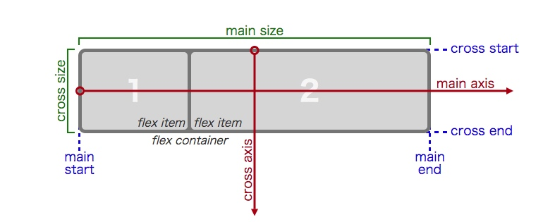
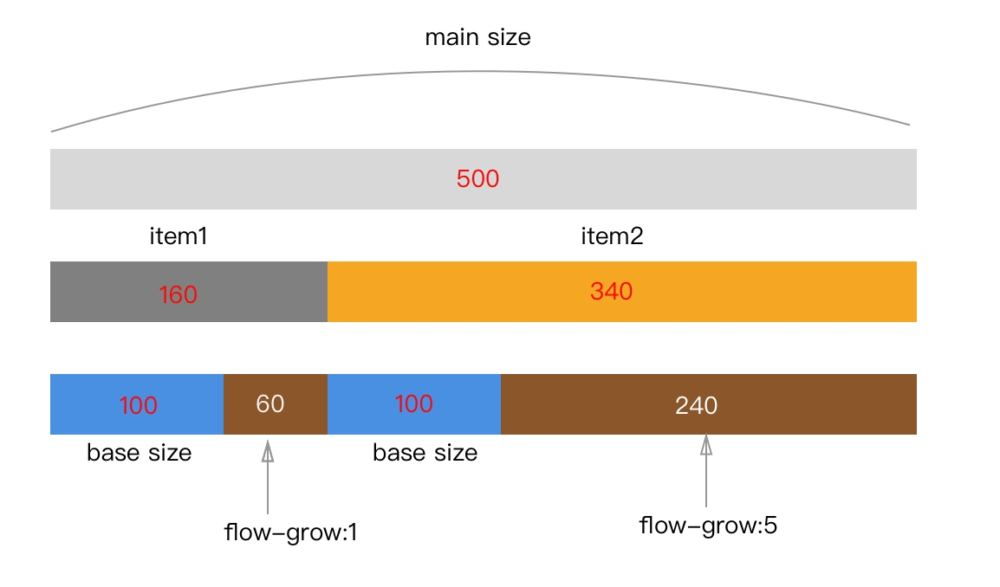
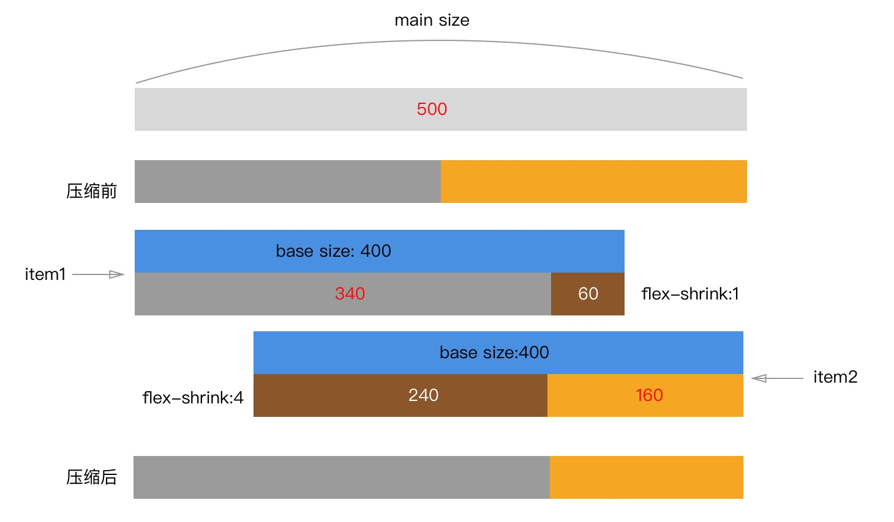
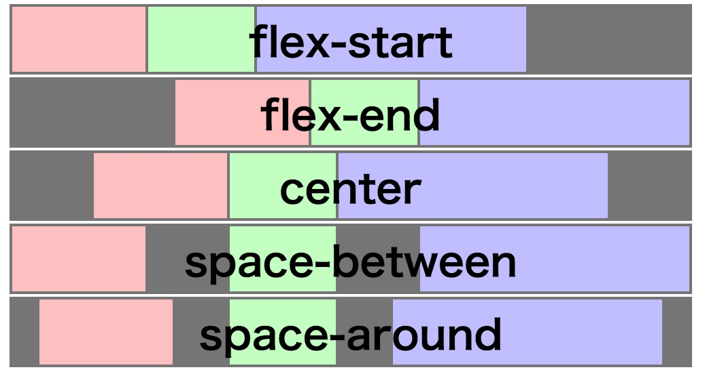
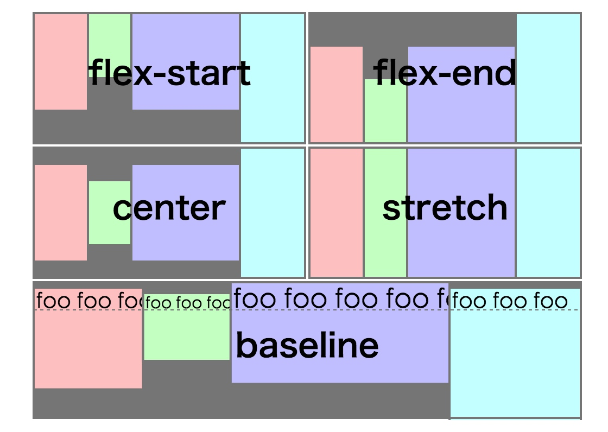
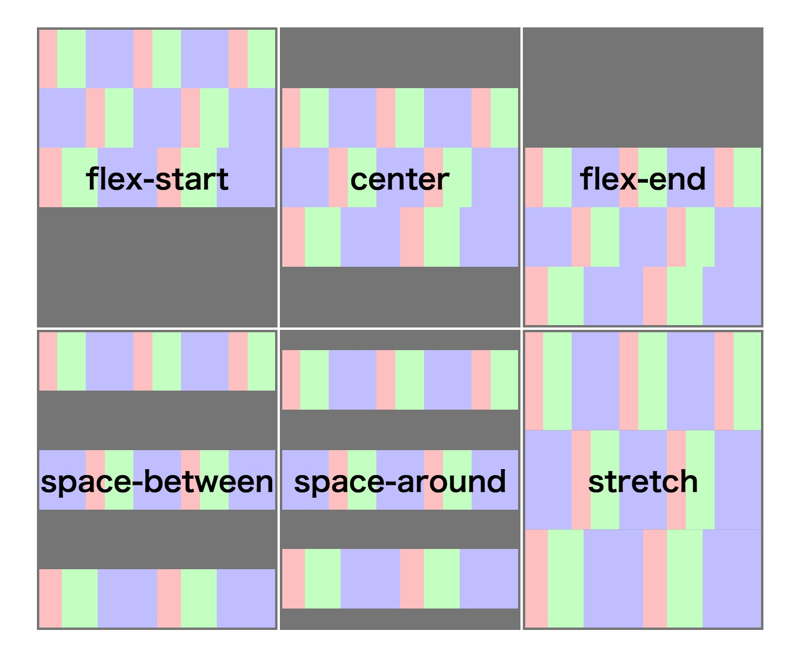

# [Learn CSS] Flexible Box Layout Module
原文地址[https://www.w3.org/TR/css-flexbox-1/](https://www.w3.org/TR/css-flexbox-1/)

## CSS常用的布局方式
1. 块级布局(block layout)：为处理文档而设计
2. 行级布局(inline layout)：为处理文本而设计
3. 表格布局(table layout)：为以表格形式处理2D数据而设计
4. 定位布局(position layout)：为有明确位置的元素而设计
5. 弹性布局(flex layout)：为处理更加复杂的应用和网页而设计

## 基本概念


## Flex Container(简称FC)
- 元素设置display为flex或inline-flex
- 元素会创建一个FFC(flex format context)
- 部分块级布局特性会在这里失效
    - margin不会重叠
    - float无法使FI脱离文档，同理clear也无效
    - vertical-align无效
    - 伪元素::first-line和::first-letter无效

## Flex Item(简称FI)
- FC里面的全部元素均为FI
- FI会创建一个FFC(flex format context)
- 子级文本节点会被包装给一个匿名块级容器的FI
- FI会进行自动提级，将部分提升到块级，例如inline，table-cell等
- 绝对定位会脱离Flex Flow
- margin会影响size

## Ordering & Orientation(排序&定向)
### flex-direction
- 指定FI在FC里面的放置位置，基于main axis
- [value] **row** | row-reverse | column | column-reverse
- row: 横向排列，从main-start向main-end排列
- row-reverse: 同row，交换了main-start和main-end
- column: 同row，顺时针旋转了axis
- column-reverse: 同column，交换了main-start和main-end

### flex-wrap
- 控制FC是单行还是多行
- [value] **nowrap** | wrap | wrap-reverse
- nowrap: 指定FC为单行，这时候当FC指定了width，FI的width之和不会超过FC的width
- wrap: 指定FC为多行，当FI的放不下的时候自动换行并对齐，开始点左上
- wrap-reverse: 与wrap类似，开始点在左下；当flex-direction:column时，FI靠右对齐

###  flex-flow
- flex-direction 和 flex-wrap合并的缩写
- [value] \<flex-direction> || \<flex-wrap>
- flex-flow会遭到writing-mode的破坏
- 当FC为单行模式的时候只有justify-content和align-self有效

### order
- 修改FI的排序
- [value] <integer> 默认0
- 无法作用在不可见的媒体，并且设置了tabindex后，tab触发顺序不受影响

## Flexibility(弹性计算)
### flex-basis
- 在通过flex因子来分配剩余空间之前，设置FI的初始main size
- [value] **auto** | content | <'width'>
- auto: 没啥用，和content一样
- content: 如果没有设置width，则为margin+border+padding+content；如果设置则取width
- <'width'>: 固定值，可以像width一样设置

### flex-grow
- 设置flex grow factor，对FC内多余空间进行分配时，FI的base size根据factor的比例进行扩大
- [value] <number>， 被忽略时默认为1
- 负数非法
- 根据FC内grow factor的总数进行平分，然后FI根据自身的grow factor扩大
- 扩大后的size始终大于base size

示例代码：

```html
<div class="container">
    <div class="item item1">item1</div>
    <div class="item item2">item2</div>
</div>
```
``` css
.container{
    display: flex;
    flex-wrap: nowrap;
    width: 500px;
}
.item{
    width: 100px;
    padding: 10px;
}
.item1{
    background: gray;
    flex-grow: 1;
}
.item2{
    background: orange;
    flex-grow: 4;
}
```
效果分析：


### flex-shrink
- 设置flex压缩因子，当对FC内超过main size的部分进行分配时，FI的base size根据factor的比例进行缩小
- [value] <number>， 被忽略时默认为1
- 负数非法
- 当FI的base size总和超过FC的main size时，FI会在FC进行等分，超出部分不可见，如果没有超出就不进行缩小
- 不管如何缩小，FI始终填满FC
- 缩小的size始终小于base size

示例代码(接上面)：

```css
.item{
    width: 400px;
    padding: 10px;
}
.item1{
    background: gray;
    flex-shrink: 1;
}
.item2{
    background: orange;
    flex-shrink: 4;
}
```
效果分析：


> 代码案例基于单行FC进行试验的，根据原理去推导多行效果，其中棕色是对象了剩余空间和溢出空间。

### flex
- 有flex-grow、flex-shrink和flex-basis组合成的缩写形式
- [value] **none** | [ <‘flex-grow’> <‘flex-shrink’>? || <‘flex-basis’> ]
- 有4个基本值，分别是：none、initial、auto和<positive-number>
- none: 0 0 auto
- initial: 0 1 auto
- auto: 1 1 auto
- \<positive-number>: \<positive-number> 1 0

## Alignment(排列)
### margin : auto
- 在**flex bases**和**flexible lengths**计算期间，auto会被视为0
- 优先级高于justify-content和align-self
- 所有可用的剩余空间都会被分配成自动边距，最终所有FI的左右边距都是一致的，上下边距也是一致的
- 如果出现溢出，则溢出对应的axis上的自动边距会被忽略

### justify-content
- 将FI基于main axis进行排列
- [value] **flex-start** | flex-end | center | space-between | space-around
- flex-start: 从main-start向main-end排列，受row-reverse影响
- flex-end: 从main-end向main-start排列，受row-reverse影响
- center: 居中排列
- space-between: 等间距排列
- space-around: 等环绕间距排列，效果类似margin: 0 auto

图例：


### align-items & align-self
- 基于cross axis排列，受flex-flow影响
- align-items应用于FC，align-self应用于FI
- [value] flex-start | flex-end | center | baseline | stretch
- align-items默认值stretch，为所有FI设置默认的align-self
- align-self多了一个默认值auto，等同于stretch，可以覆盖FC的align-items
- flex-start: 从cross-start向cross-end排列
- flex-end: 从cross-end向cross-start排序
- center: 居中排列
- baseline: 基于首行文本的baseline排列
- stretch: 基于flex-start排列，然后进行拉伸
    - 没有设置height的自动拉伸到flex-end
    - 当设置margin-top和margin-bottom为auto时，stretch无效
    - 当设置margin-top为固定值时，从固定值开始排列
    - 当设置margin-bottom为固定值是，拉伸到flex-end减去margin-bottom

图例：


### align-content
- 基于cross axis排列，应用于多行FC，需要额外的空余空间，对单行FC无效
- [value] flex-start | flex-end | center | space-between | space-around | **stretch**
- flex-start: 从cross-start向cross-end排列
- flex-end: 从cross-end向cross-start排列，其他如同flex-start
- center: 居中排列
- space-between: 等间距排列
- space-around: 等边距排列
- stretch: 拉伸排列
- 每行高度取决于该行最高的FI，没有设置高度的FI，自动拉伸铺满
- 当FC没有设置height时，align-content无效
- 当发生溢出时，从结束的方向进行溢出

图例：


##  结束语
最后其实还有布局计算，但是这一块比较关键而且复杂， 所以布局计算这一块需要仔细去看源文档，尤其是关于flex base size的计算，如果搞不清楚这个，关于flex这个属性的计算就不会弄明白。还有一个就是剩余空间和溢出空间的计算，在原文中用的positive free space和negative free space，在计算溢出空间的时候大家很难想象，对于明确的flex-basis还好计算，如果出现文本过长导致的空间溢出，这是的溢出空间计算就没那么直观，毕竟溢出空间是看不到的。
在学习和研究一个特性的时候，最好的方法是阅读标准文档，可以全面的了解这个特性可以做什么，怎么做，为什么怎么做，在学习的过程你会发现又很多有趣的思路，这些思路也可用于实践中。


